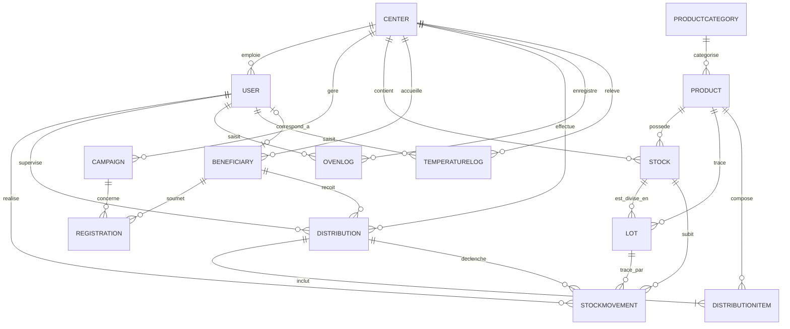

# Modèle Conceptuel de Données (MCD)

Le modèle conceptuel décrit les entités du système et leurs associations. Voici la représentation via un diagramme Entité-Association :

# Modèle Relationnel

Le modèle relationnel traduit les entités et associations en tables et clés.

*   **User** (id, email, name, passwordHash, role, phone, createdAt, updatedAt, isActive, centerId#)
*   **Center** (id, name, address, city, postalCode, phone, email, isActive, createdAt, updatedAt)
*   **Campaign** (id, name, description, startDate, endDate, isActive, createdAt, updatedAt, centerId#)
*   **Beneficiary** (id, firstName, lastName, dateOfBirth, phone, email, address, city, postalCode, householdSize, adultsCount, childrenCount, monthlyIncome, socialStatus, pointsBalance, isActive, createdAt, updatedAt, centerId#, userId#)
*   **Registration** (id, status, notes, createdAt, updatedAt, approvedAt, beneficiaryId#, campaignId#)
*   **ProductCategory** (id, name, description, pointsCost, createdAt)
*   **Product** (id, name, description, unit, pointsCost, isActive, createdAt, updatedAt, categoryId#)
*   **Stock** (id, quantity, minQuantity, updatedAt, centerId#, productId#)
*   **Lot** (id, batchNumber, quantity, expiryDate, receivedDate, source, notes, productId#, stockId#)
*   **StockMovement** (id, type, quantity, reason, createdAt, lotId#, stockId#, userId#, distributionId#)
*   **Distribution** (id, totalPoints, notes, createdAt, beneficiaryId#, userId#, centerId#)
*   **DistributionItem** (id, quantity, pointsCost, distributionId#, productId#)
*   **OvenLog** (id, ovenName, turnOnTime, turnOffTime, temperature, notes, createdAt, centerId#, userId#)
*   **TemperatureLog** (id, dishName, temperature, checkType, isCompliant, measuredAt, notes, centerId#, userId#)

*(Les attributs suivis d'un # sont des clés étrangères)*

# Dictionnaire des Données

User
id
email
name
passwordHash
role
phone
createdAt
updatedAt
isActive
centerId
Center
address
city
postalCode
Campaign
description
startDate
endDate
Beneficiary
firstName
lastName
dateOfBirth
householdSize
adultsCount
childrenCount
monthlyIncome
socialStatus
pointsBalance
userId
Registration
status
notes
approvedAt
beneficiaryId
campaignId
ProductCategory
pointsCost
Product
unit
categoryId
Stock
quantity
minQuantity
productId
Lot
batchNumber
expiryDate
receivedDate
source
stockId
StockMovement
type
reason
lotId
distributionId
Distribution
totalPoints
DistributionItem
OvenLog
ovenName
turnOnTime
turnOffTime
temperature
TemperatureLog
dishName
checkType
isCompliant
measuredAt

# Schéma de la Base de Données

| Table | Clé Primaire | Clés Étrangères | Autres Attributs |
| :--- | :--- | :--- | :--- |
| **User** | id | centerId (Center) | email, name, passwordHash, role, phone, createdAt, updatedAt, isActive |
| **Center** | id | - | name, address, city, postalCode, phone, email, isActive, createdAt, updatedAt |
| **Campaign** | id | centerId (Center) | name, description, startDate, endDate, isActive, createdAt, updatedAt |
| **Beneficiary** | id | centerId (Center), userId (User) | firstName, lastName, dateOfBirth, phone, email, address, city, postalCode, householdSize, adultsCount, childrenCount, monthlyIncome, socialStatus, pointsBalance, isActive, createdAt, updatedAt |
| **Registration** | id | beneficiaryId (Beneficiary), campaignId (Campaign) | status, notes, createdAt, updatedAt, approvedAt |
| **ProductCategory** | id | - | name, description, pointsCost, createdAt |
| **Product** | id | categoryId (ProductCategory) | name, description, unit, pointsCost, isActive, createdAt, updatedAt |
| **Stock** | id | centerId (Center), productId (Product) | quantity, minQuantity, updatedAt |
| **Lot** | id | productId (Product), stockId (Stock) | batchNumber, quantity, expiryDate, receivedDate, source, notes |
| **StockMovement** | id | lotId (Lot), stockId (Stock), userId (User), distributionId (Distribution) | type, quantity, reason, createdAt |
| **Distribution** | id | beneficiaryId (Beneficiary), userId (User), centerId (Center) | totalPoints, notes, createdAt |
| **DistributionItem** | id | distributionId (Distribution), productId (Product) | quantity, pointsCost |
| **OvenLog** | id | centerId (Center), userId (User) | ovenName, turnOnTime, turnOffTime, temperature, notes, createdAt |
| **TemperatureLog** | id | centerId (Center), userId (User) | dishName, temperature, checkType, isCompliant, measuredAt, notes |

# Tableau Récapitulatif des Requêtes

*(Note : le détail n'étant pas fourni dans la demande, voici un listing typique selon l'analyse du modèle de données de l'application)*

| Identifiant | Description de la Requête | Tables impliquées | Type d'Opération |
| :--- | :--- | :--- | :--- |
| REQ_01 | Lister tous les bénéficiaires actifs d'un centre | Beneficiary | SELECT |
| REQ_02 | Obtenir le stock actuel et le seuil d'alerte des produits d'un centre | Stock, Product | SELECT |
| REQ_03 | Créer une nouvelle distribution (panier) pour un bénéficiaire | Distribution, DistributionItem | INSERT |
| REQ_04 | Mettre à jour l'état d'une démarche d'enregistrement (Registration) | Registration | UPDATE |
| REQ_05 | Tracer une entrée/sortie physique de stock | StockMovement, Stock, Lot | INSERT, UPDATE |
| REQ_06 | Inscrire les relevés de température quotidiens | TemperatureLog | INSERT |
| REQ_07 | Récupérer les campagnes actives prévues le mois en cours | Campaign | SELECT |
| REQ_08 | Déduire les points d'un bénéficiaire après distribution | Beneficiary | UPDATE |
| REQ_09 | Suivre l'utilisation d'un four (allumage, extinction) | OvenLog | INSERT, UPDATE |
