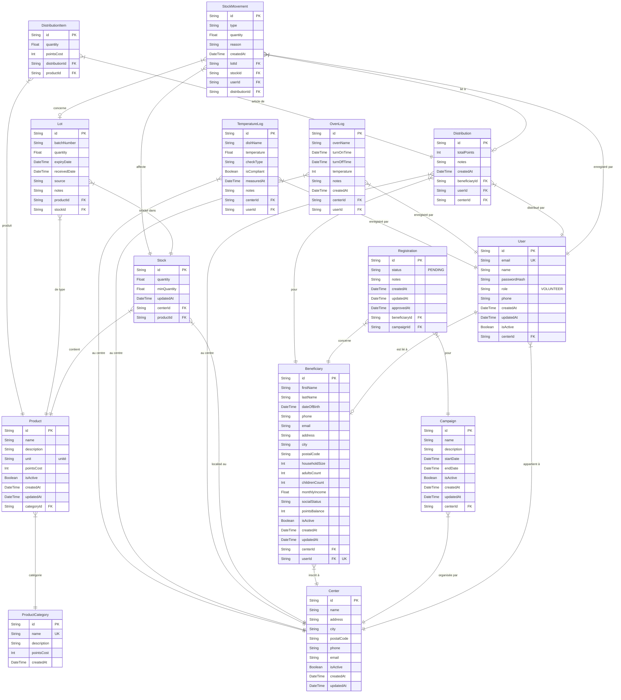

# Modélisation de la Base de Données - CoeurSolidaire

Voici le diagramme Entité-Relation (ERD) généré à partir de votre fichier `prisma/schema.prisma`. Il montre les tables, les clés primaires (PK), les clés étrangères (FK) et les relations entre les tables.

