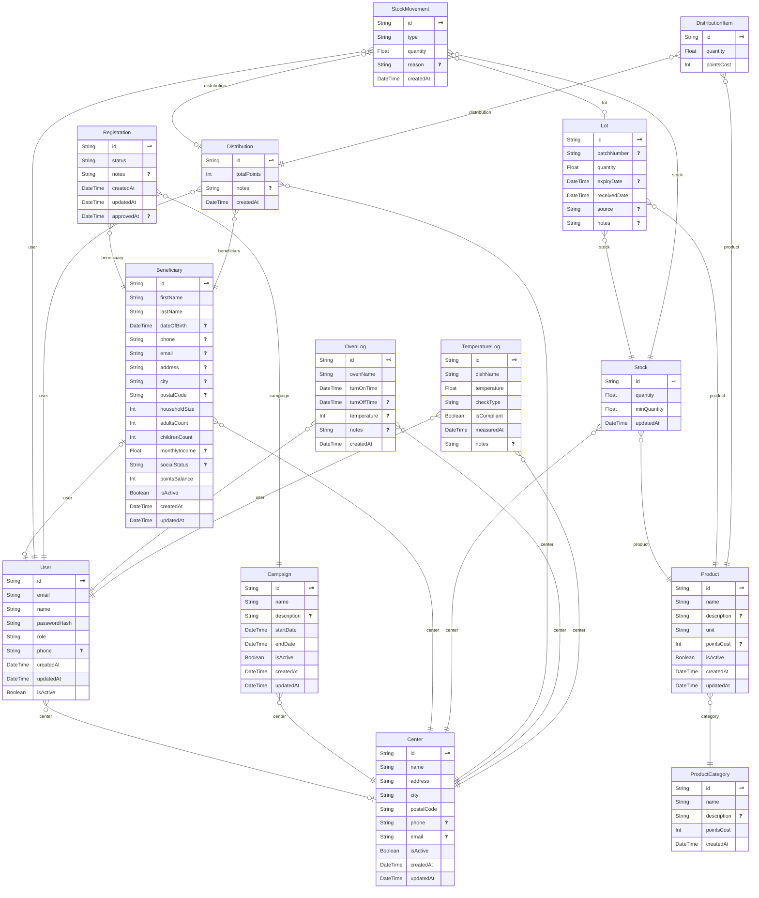

```mermaid
erDiagram

  "User" {
    String id "🗝️"
    String email 
    String name 
    String passwordHash 
    String role 
    String phone "❓"
    DateTime createdAt 
    DateTime updatedAt 
    Boolean isActive 
    }
  

  "Center" {
    String id "🗝️"
    String name 
    String address 
    String city 
    String postalCode 
    String phone "❓"
    String email "❓"
    Boolean isActive 
    DateTime createdAt 
    DateTime updatedAt 
    }
  

  "Campaign" {
    String id "🗝️"
    String name 
    String description "❓"
    DateTime startDate 
    DateTime endDate 
    Boolean isActive 
    DateTime createdAt 
    DateTime updatedAt 
    }
  

  "Beneficiary" {
    String id "🗝️"
    String firstName 
    String lastName 
    DateTime dateOfBirth "❓"
    String phone "❓"
    String email "❓"
    String address "❓"
    String city "❓"
    String postalCode "❓"
    Int householdSize 
    Int adultsCount 
    Int childrenCount 
    Float monthlyIncome "❓"
    String socialStatus "❓"
    Int pointsBalance 
    Boolean isActive 
    DateTime createdAt 
    DateTime updatedAt 
    }
  

  "Registration" {
    String id "🗝️"
    String status 
    String notes "❓"
    DateTime createdAt 
    DateTime updatedAt 
    DateTime approvedAt "❓"
    }
  

  "ProductCategory" {
    String id "🗝️"
    String name 
    String description "❓"
    Int pointsCost 
    DateTime createdAt 
    }
  

  "Product" {
    String id "🗝️"
    String name 
    String description "❓"
    String unit 
    Int pointsCost "❓"
    Boolean isActive 
    DateTime createdAt 
    DateTime updatedAt 
    }
  

  "Stock" {
    String id "🗝️"
    Float quantity 
    Float minQuantity 
    DateTime updatedAt 
    }
  

  "Lot" {
    String id "🗝️"
    String batchNumber "❓"
    Float quantity 
    DateTime expiryDate "❓"
    DateTime receivedDate 
    String source "❓"
    String notes "❓"
    }
  

  "StockMovement" {
    String id "🗝️"
    String type 
    Float quantity 
    String reason "❓"
    DateTime createdAt 
    }
  

  "Distribution" {
    String id "🗝️"
    Int totalPoints 
    String notes "❓"
    DateTime createdAt 
    }
  

  "DistributionItem" {
    String id "🗝️"
    Float quantity 
    Int pointsCost 
    }
  

  "OvenLog" {
    String id "🗝️"
    String ovenName 
    DateTime turnOnTime 
    DateTime turnOffTime "❓"
    Int temperature "❓"
    String notes "❓"
    DateTime createdAt 
    }
  

  "TemperatureLog" {
    String id "🗝️"
    String dishName 
    Float temperature 
    String checkType 
    Boolean isCompliant 
    DateTime measuredAt 
    String notes "❓"
    }
  
    "User" }o--|o "Center" : "center"
    "Campaign" }o--|| "Center" : "center"
    "Beneficiary" }o--|| "Center" : "center"
    "Beneficiary" |o--|o "User" : "user"
    "Registration" }o--|| "Beneficiary" : "beneficiary"
    "Registration" }o--|| "Campaign" : "campaign"
    "Product" }o--|| "ProductCategory" : "category"
    "Stock" }o--|| "Center" : "center"
    "Stock" }o--|| "Product" : "product"
    "Lot" }o--|| "Product" : "product"
    "Lot" }o--|| "Stock" : "stock"
    "StockMovement" }o--|o "Lot" : "lot"
    "StockMovement" }o--|| "Stock" : "stock"
    "StockMovement" }o--|| "User" : "user"
    "StockMovement" }o--|o "Distribution" : "distribution"
    "Distribution" }o--|| "Beneficiary" : "beneficiary"
    "Distribution" }o--|| "User" : "user"
    "Distribution" }o--|| "Center" : "center"
    "DistributionItem" }o--|| "Distribution" : "distribution"
    "DistributionItem" }o--|| "Product" : "product"
    "OvenLog" }o--|| "Center" : "center"
    "OvenLog" }o--|| "User" : "user"
    "TemperatureLog" }o--|| "Center" : "center"
    "TemperatureLog" }o--|| "User" : "user"
```
