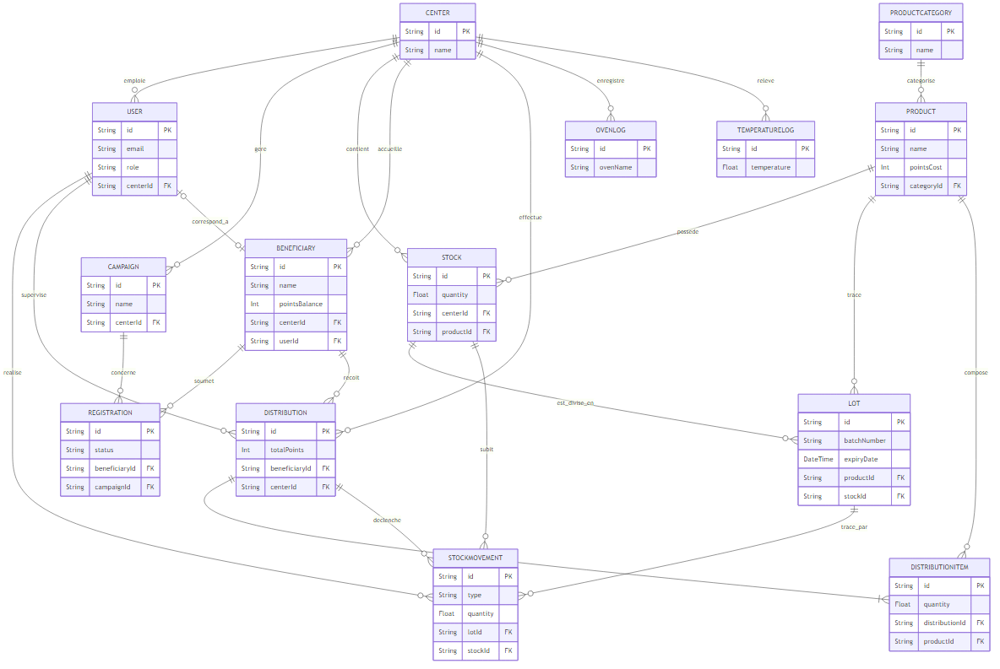

<h1 align="center">Schémas BDD : Coeur Solidaire</h1>

 

## 1. Modèle Conceptuel de Données (MCD)

Le MCD modélise les entités avec leurs attributs principaux et les associations (verbes) qui les lient.

  

 

**Légende des Cardinalités (notation "patte de corbeau / Crow's foot") :**
* `||` (Double barre) : **Exactement 1** *(1,1)*
* `o|` ou `|o` (Un cercle et une barre) : **0 ou 1** *(0,1)*
* `o{` (Un cercle et 3 branches) : **0 ou plusieurs** *(0,N)*
* `|{` (Une barre et 3 branches) : **1 ou plusieurs** *(1,N)*

 
 

 

## 2. Modèle Relationnel des Données (MRD)

Le MRD décrit les tables physiques de la base de données.
* **<u>PK</u>** = *Primary Key* (Clé primaire, soulignée)
* **➔ FK** = *Foreign Key* (Clé étrangère reliant une autre table)

### 🏢 Bénévoles & Centres
 

| Table | Structure complète (Attributs) | Description |
|---|---|---|
| **CENTER** | <u>id</u> (PK), name, address, city, postalCode, phone, email, isActive, createdAt, updatedAt | Le lieu physique de distribution |
| **USER** | <u>id</u> (PK), ➔ centerId (FK), email, name, passwordHash, role, phone, isActive, createdAt... | Les membres de l'équipe (ex: admin, bénévoles) |

### 👥 Bénéficiaires & Campagnes
 

| Table | Structure complète (Attributs) | Description |
|---|---|---|
| **CAMPAIGN** | <u>id</u> (PK), ➔ centerId (FK), name, description, startDate, endDate, isActive, createdAt... | Les sessions d'inscriptions (ex: Hiver 26) |
| **BENEFICIARY** | <u>id</u> (PK), ➔ centerId (FK), ➔ userId (FK-facultatif), firstName, lastName, dateOfBirth, householdSize, adultsCount, childrenCount, monthlyIncome, socialStatus, pointsBalance, isActive... | Un foyer de bénéficiaires |
| **REGISTRATION** | <u>id</u> (PK), ➔ beneficiaryId (FK), ➔ campaignId (FK), status, notes, approvedAt, createdAt... | Le dossier liant un foyer à une campagne |

### 📦 Produits, Stocks & Traçabilité (HACCP)
 

| Table | Structure complète (Attributs) | Description |
|---|---|---|
| **PRODUCTCATEGORY** | <u>id</u> (PK), name, description, pointsCost, createdAt | Famille d'aliments (Laitages, Féculents...) |
| **PRODUCT** | <u>id</u> (PK), ➔ categoryId (FK), name, description, unit, pointsCost, isActive, createdAt... | Fiche d'un produit alimentaire spécifique |
| **STOCK** | <u>id</u> (PK), ➔ centerId (FK), ➔ productId (FK), quantity, minQuantity, updatedAt | Quantité globale d'un produit dans un centre |
| **LOT** | <u>id</u> (PK), ➔ productId (FK), ➔ stockId (FK), batchNumber, quantity, expiryDate, receivedDate... | Un lot physique (gestion rigoureuse des DLC) |
| **STOCKMOVEMENT** | <u>id</u> (PK), ➔ lotId (FK-facultatif), ➔ stockId (FK), ➔ userId (FK), ➔ distributionId (FK), type, quantity, reason... | Historisation comptable des entrées/sorties |

### 🛒 Distributions & Logistique
 

| Table | Structure complète (Attributs) | Description |
|---|---|---|
| **DISTRIBUTION** | <u>id</u> (PK), ➔ beneficiaryId (FK), ➔ userId (FK), ➔ centerId (FK), totalPoints, notes... | Le "ticket" ou "panier" de distribution du jour |
| **DISTRIBUTIONITEM**| <u>id</u> (PK), ➔ distributionId (FK), ➔ productId (FK), quantity, pointsCost | Les articles qui ont été placés dans le panier |

### 🌡️ Normes Sanitaires Obligatoires
 

| Table | Structure complète (Attributs) | Description |
|---|---|---|
| **OVENLOG** | <u>id</u> (PK), ➔ centerId (FK), ➔ userId (FK), ovenName, turnOnTime, turnOffTime, temperature... | Registre encadrant l'utilisation des fours |
| **TEMPERATURELOG** | <u>id</u> (PK), ➔ centerId (FK), ➔ userId (FK), dishName, temperature, checkType, isCompliant... | Relevés à cœur validant la chaîne du chaud/froid |
